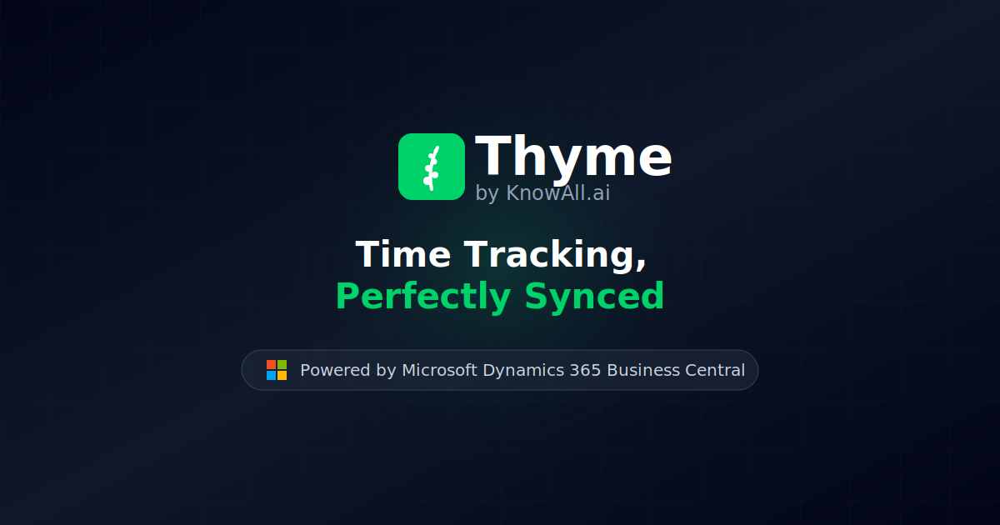
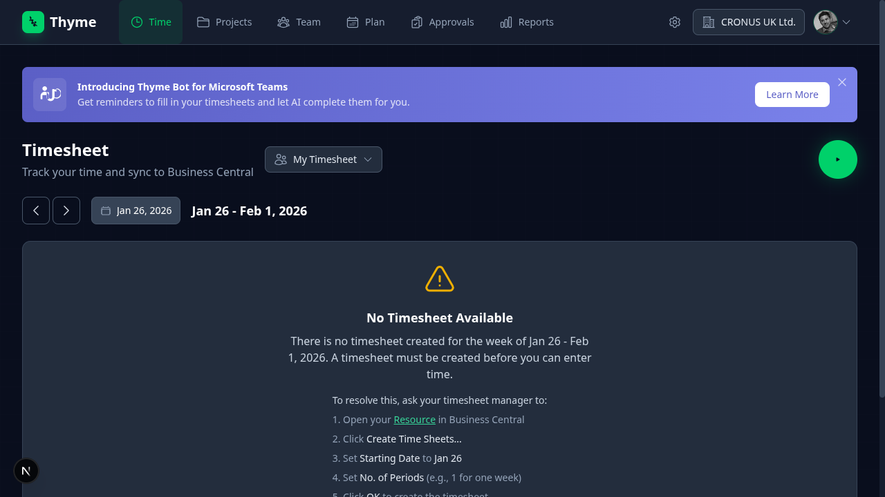
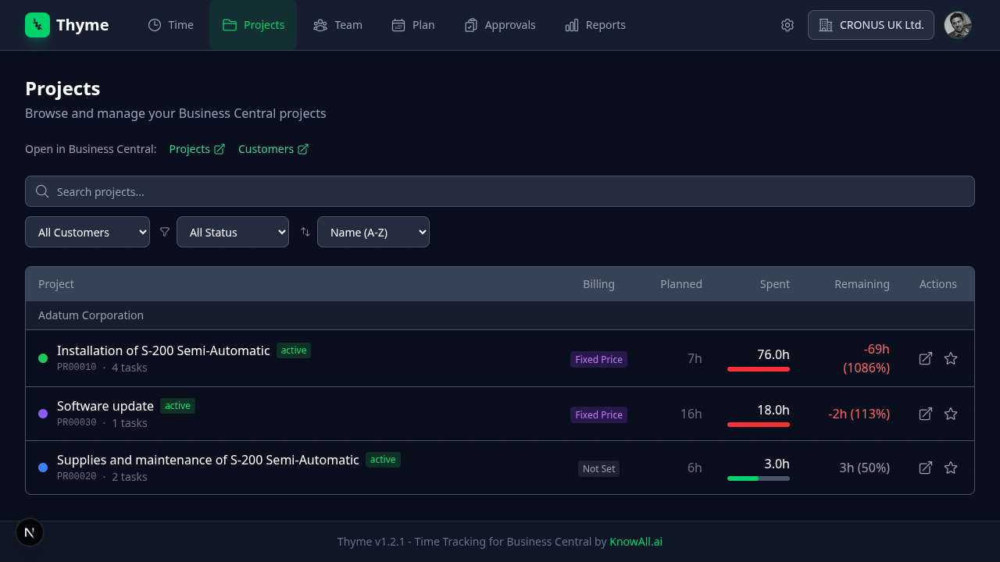
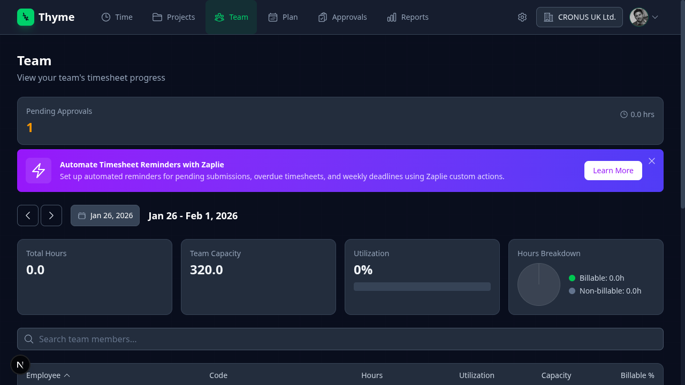
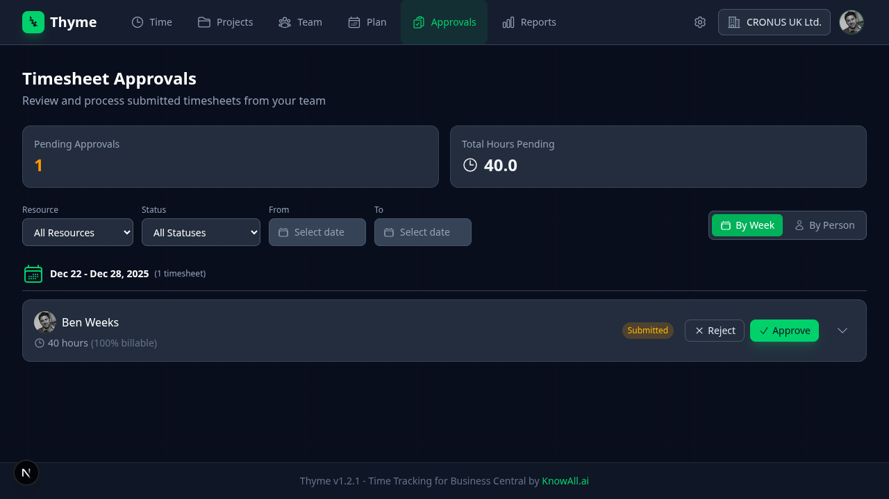
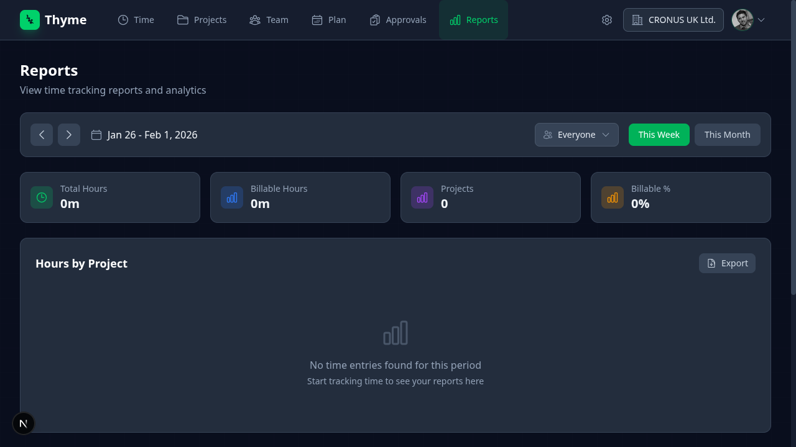

# Thyme - Time Tracking for Business Central



A modern time tracking web application that integrates with Microsoft Dynamics 365 Business Central. Built by [KnowAll.ai](https://knowall.ai).

## Features

- **Weekly Timesheet View** - Track time across the week with an intuitive grid layout
- **Real-time Timer** - Start/stop timer for accurate time tracking
- **Business Central Sync** - Automatic synchronization with BC Jobs and Job Journal Lines
- **Microsoft Authentication** - Secure SSO via Microsoft Entra ID
- **Dark Theme** - Modern, eye-friendly dark interface
- **Mobile Responsive** - Works on desktop and mobile devices

## Screenshots

|                                                                                    |                                                                                 |
| :--------------------------------------------------------------------------------: | :-----------------------------------------------------------------------------: |
| [](public/screenshots/timesheet.png) | [](public/screenshots/projects.png) |
|                       **Timesheet** - Weekly time entry grid                       |                        **Projects** - Browse BC projects                        |
|        [](public/screenshots/team.png)         |       [](public/screenshots/plan.png)       |
|                            **Team** - View team status                             |                         **Plan** - Resource scheduling                          |
| [](public/screenshots/approvals.png) |  [](public/screenshots/reports.png)   |
|                         **Approvals** - Review timesheets                          |                        **Reports** - Analytics & export                         |

## Tech Stack

| Layer    | Technology                   |
| -------- | ---------------------------- |
| Frontend | React 19, Next.js 16         |
| Styling  | Tailwind CSS 4               |
| State    | Zustand                      |
| Auth     | MSAL.js (Microsoft Entra ID) |
| Data     | Business Central OData API   |
| Testing  | Playwright, Vitest           |
| Runtime  | Bun                          |
| Hosting  | Azure App Service            |

## Getting Started

### Prerequisites

- [Bun](https://bun.sh) 1.0+
- Azure subscription with Entra ID
- Business Central environment

### Installation

```bash
# Clone the repository
git clone https://github.com/knowall-ai/thyme.git
cd thyme

# Install dependencies
bun install

# Set up environment variables
cp .env.example .env.local
# Edit .env.local with your Azure/BC credentials

# Run development server
bun run dev
```

Open [http://localhost:3000](http://localhost:3000) in your browser.

### Environment Variables

```bash
NEXT_PUBLIC_AZURE_CLIENT_ID=<entra-app-client-id>
AZURE_CLIENT_SECRET=<entra-app-secret>
NEXT_PUBLIC_AZURE_TENANT_ID=<tenant-id>
BC_ENVIRONMENT=<production|sandbox>
BC_COMPANY_ID=<business-central-company-guid>
```

## Development

### Scripts

```bash
bun run dev          # Start development server
bun run build        # Build for production
bun run start        # Start production server
bun run lint         # Run ESLint
bun run lint:fix     # Run ESLint with auto-fix
bun run format       # Format code with Prettier
bun run format:check # Check formatting without changes
bun run test         # Run unit tests
bun run test:e2e     # Run E2E tests
bun run typecheck    # Run TypeScript checks
bun run check        # Run all checks (format, lint, typecheck, build)
```

### Code Quality Checks

Before submitting a PR, ensure all checks pass:

```bash
bun run check
```

This runs:

1. **Format check** - Prettier formatting validation
2. **Lint** - ESLint code quality rules
3. **Type check** - TypeScript type validation
4. **Build** - Production build verification

These checks also run automatically via GitHub Actions on every PR.

### Project Structure

```
thyme/
├── .github/
│   └── AGENTS.md              # AI assistant personas
├── docs/
│   ├── SOLUTION_DESIGN.adoc   # Architecture overview
│   ├── DEPLOYMENT.adoc        # Deployment guide
│   ├── TESTING.adoc           # Test documentation
│   └── TROUBLESHOOTING.adoc   # Problem/solution guide
├── src/
│   ├── app/                   # Next.js pages
│   ├── components/            # React components
│   ├── hooks/                 # Custom hooks & stores
│   ├── services/              # API clients
│   ├── types/                 # TypeScript types
│   └── utils/                 # Utilities
├── tests/
│   ├── e2e/                   # Playwright tests
│   └── unit/                  # Vitest tests
└── public/                    # Static assets
```

## Deployment

Deploy to Azure App Service:

```bash
bun run build
# Deploy .next/standalone to Azure
```

See [docs/DEPLOYMENT.adoc](docs/DEPLOYMENT.adoc) for detailed instructions.

## Documentation

- [Solution Design](docs/SOLUTION_DESIGN.adoc) - Architecture and design
- [Deployment Guide](docs/DEPLOYMENT.adoc) - Azure setup
- [Testing Guide](docs/TESTING.adoc) - Running tests
- [Troubleshooting](docs/TROUBLESHOOTING.adoc) - Common issues

## Contributing

This is an internal tool for KnowAll.ai. For issues or feature requests, please use GitHub Issues.

## License

Proprietary - KnowAll.ai
